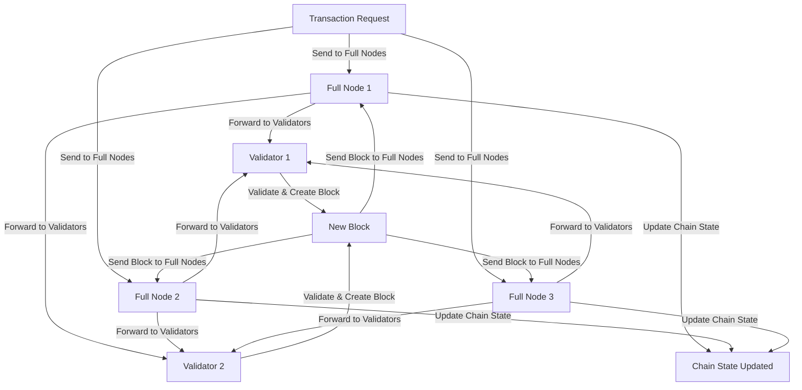

# My DAG Overview

This is a high-level overview of the Directed Acyclic Graph (DAG) with 3 Full Nodes and 2 Validators.

```mermaid
graph TD
    A[Transaction Request] -->|Send to Full Nodes| FN1[Full Node 1]
    A -->|Send to Full Nodes| FN2[Full Node 2]
    A -->|Send to Full Nodes| FN3[Full Node 3]

    FN1 -->|Forward to Validators| V1[Validator 1]
    FN2 -->|Forward to Validators| V1
    FN3 -->|Forward to Validators| V1

    FN1 -->|Forward to Validators| V2[Validator 2]
    FN2 -->|Forward to Validators| V2
    FN3 -->|Forward to Validators| V2

    V1 -->|Validate & Create Block| B[New Block]
    V2 -->|Validate & Create Block| B

    B -->|Send Block to Full Nodes| FN1
    B -->|Send Block to Full Nodes| FN2
    B -->|Send Block to Full Nodes| FN3

    FN1 -->|Update Chain State| C[Chain State Updated]
    FN2 -->|Update Chain State| C
    FN3 -->|Update Chain State| C
```